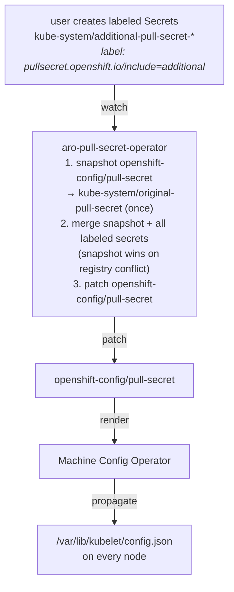

# ARO Pull Secret Operator

A controller that lets ARO administrators add **multiple** pull secrets
to a cluster by dropping `Secret` objects into `kube-system`, instead of
hand-merging credentials into `openshift-config/pull-secret`.

It is the spiritual port of HyperShift's
[`globalps`](https://github.com/openshift/hypershift/tree/main/control-plane-operator/hostedclusterconfigoperator/controllers/globalps)
feature to classic OpenShift / ARO.

## Why a port and not the upstream code?

HyperShift's design writes `/var/lib/kubelet/config.json` directly on
each node via a privileged DaemonSet, then restarts the kubelet. That
works on HyperShift because hosted clusters using the **Replace**
upgrade strategy have no Machine Config Daemon competing for the file.
HyperShift's own controller explicitly excludes **InPlace** nodepools
for this reason.

On classic OpenShift every worker is effectively an InPlace node — MCO
owns kubelet config. Running the HyperShift DaemonSet on ARO would
fight MCD every 30 seconds.

This operator gives you the same user-facing capability without that
fight: it merges the additional pull secrets into
`openshift-config/pull-secret`. **MCO then propagates the change to
every node through the normal render pipeline**, exactly as if you had
hand-merged the secret yourself.

## Behaviour



### Conflict policy

If an additional secret carries credentials for a registry the original
cluster pull secret already has, **the original wins**. This matches
HyperShift's semantics and prevents accidental displacement of
mission-critical cluster credentials. Use namespaced registry paths
(e.g. `quay.io/myorg`) in additional secrets to avoid collisions.

### Bootstrap & restart safety

On first reconcile, if `kube-system/original-pull-secret` does not yet
exist, the operator snapshots the current `openshift-config/pull-secret`
into it. From that point on, every merge uses the snapshot as the
base, so:

- adding then removing an additional secret returns the cluster pull
  secret to exactly its pre-operator state;
- restarts of the operator are idempotent.

If the snapshot is deleted while the cluster pull secret is still
operator-managed, the operator **refuses to bootstrap** from the
derived value. Restore the snapshot before continuing.

## Install

```bash
oc apply -f config/manager/namespace.yaml
oc apply -f config/rbac/rbac.yaml
oc apply -f config/manager/deployment.yaml
```

Replace the image reference in `deployment.yaml` with the operator
image you publish.

## Use

Add an additional pull secret:

```bash
oc create secret docker-registry my-registry-creds \
  --docker-server=registry.example.com \
  --docker-username='...' \
  --docker-password='...' \
  -n kube-system

oc label secret my-registry-creds -n kube-system \
  pullsecret.openshift.io/include=additional
```

The operator will see the labelled secret, merge it into
`openshift-config/pull-secret`, and MCO will roll the change out.

Remove it:

```bash
oc delete secret my-registry-creds -n kube-system
```

The operator removes the merged entry on the next reconcile.

## Annotations on managed objects

| Object | Annotation | Value |
|---|---|---|
| `openshift-config/pull-secret` | `pullsecret.openshift.io/managed-by` | `aro-pull-secret-operator` |
| `openshift-config/pull-secret` | `pullsecret.openshift.io/content-hash` | first 12 hex chars of SHA-256 of merged content |
| `kube-system/original-pull-secret` | `pullsecret.openshift.io/managed-by` | `aro-pull-secret-operator` |

## Build

```bash
go build ./cmd/manager
# or
docker build -t quay.io/openshift/aro-pull-secret-operator:dev .
```

## License

Apache License, Version 2.0. See [LICENSE](LICENSE).
